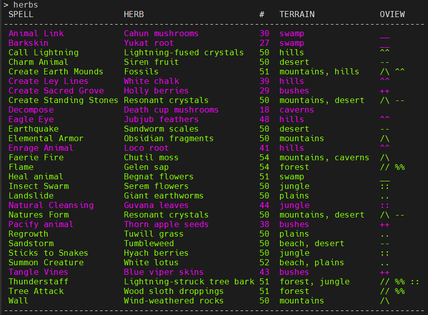
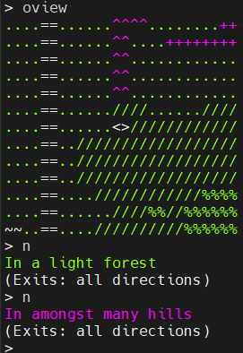

### TinTin++ herbs command parser for the Druid class on Moral Decay LPMUD
This takes the herbs command and merges the spells with their corresponding herbs and the terrain where they are found. The normal output of the herbs command is greatly improved to help streamline foraging for druids in Moral Decay LPMUD (telnet playdecay.com 3003). Highlighting will improve readability, you can easily identify spells in the herbs list that are not at the herb capacity. Terrain in the wilderness will be highlighted, terrain in the eagle eye overview (oview) will be highlighted.

To activate it in your tt++
```
git clone https://github.com/aladrin/druid-foraging.git
```
Then move druid-foraging.ttrc to where you want and in your tintinrc
```
#read /path/to/druid-foraging.ttrc
```

